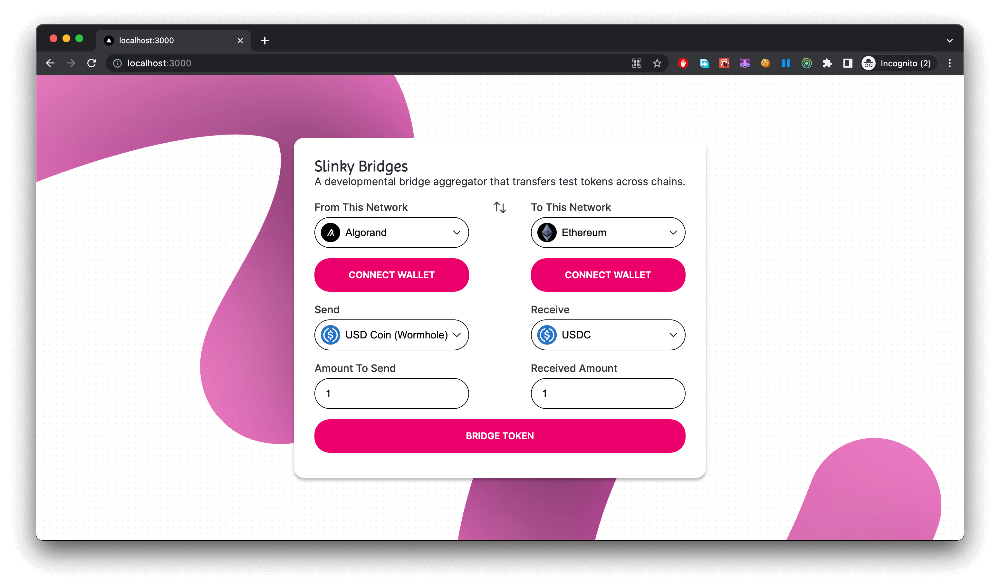

## Introduction

[Slinky Bridges]() is a developmental bridge aggregator that transfers test tokens across chains.

## 🤖 Tech stack

Slinky bridges uses holds all 3rd party bridge plugins in the `bridges` folder.

### Bridges

#### [@/bridges/wormhole](./src/bridges/wormhole/)

Wormhole is a generic message passing protocol that connects to multiple chains including Ethereum, Solana, Binance Smart Chain, Polygon, Avalanche, Algorand, Fantom, Karura, Celo, Acala, Aptos and Arbitrum.

It exports useful methods to interact with wormhole:

- [network-graphs](./src/bridges/wormhole/graphs/): A graph relation of `Networks` and supported exchages between `Tokens`. It defines the presentation of network and token relationships in the UI.
- [core](/src/bridges/wormhole/core/): Contains essential internal files and modules used by wormhole
- [utils](/src/bridges/wormhole/utils/): Helpful parsers and constants for wormhole  

#### [@/bridges/glitter-bridge](./src/bridges/glitter-bridge/)

 Glitter bridge powers cross-chain transfer of assets between Non-EVM and EVM supported networks bidirectionally, the first being the Algorand and Solana blockchain networks.  
 
 Glitter bride integration coming soon.

## License

MIT © [Kelvin Praies](https://github.com/kelvinpraies)
